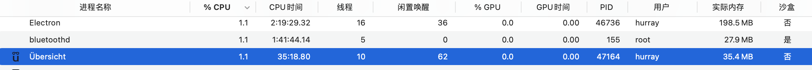

# uebersicht-live2d
show live2d on Mac desktop

## HOW-TO-USE
The project is based on uebersicht/Übersicht App on Mac.
Please download it and load this project to its Widget Folder.

## Cost
Test on my MBP19(i9)
* CPU: about 0%-%4
* memory: 30-40MB

